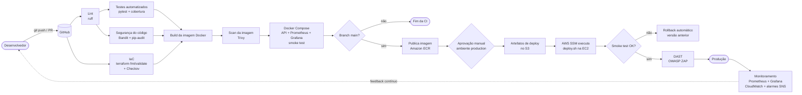

# Fluxograma do fluxo DevOps

```mermaid
flowchart LR
    DEV([Desenvolvedor]) -->|git push / PR| GH[(GitHub)]
    GH --> LINT[Lint<br/>ruff]
    LINT --> TEST[Testes automatizados<br/>pytest + cobertura]
    LINT --> SAST[Segurança do código<br/>Bandit + pip-audit]
    GH --> IAC[IaC<br/>terraform fmt/validate<br/>+ Checkov]
    TEST --> BUILD
    SAST --> BUILD
    IAC --> BUILD
    BUILD[Build da imagem Docker] --> TRIVY[Scan da imagem<br/>Trivy]
    TRIVY --> COMPOSE[Docker Compose<br/>API + Prometheus + Grafana<br/>smoke test]
    COMPOSE --> Q{Branch main?}
    Q -- não --> FIM1([Fim da CI])
    Q -- sim --> ECR[Publica imagem<br/>Amazon ECR]
    ECR --> APROV{Aprovação manual<br/>ambiente production}
    APROV --> S3[Artefatos de deploy<br/>no S3]
    S3 --> SSM[AWS SSM executa<br/>deploy.sh na EC2]
    SSM --> SMOKE{Smoke test OK?}
    SMOKE -- não --> RB[Rollback automático<br/>versão anterior]
    SMOKE -- sim --> DAST[DAST<br/>OWASP ZAP]
    DAST --> PROD([Produção])
    PROD --> MON[Monitoramento<br/>Prometheus + Grafana<br/>CloudWatch + alarmes SNS]
    MON -. feedback contínuo .-> DEV
```
